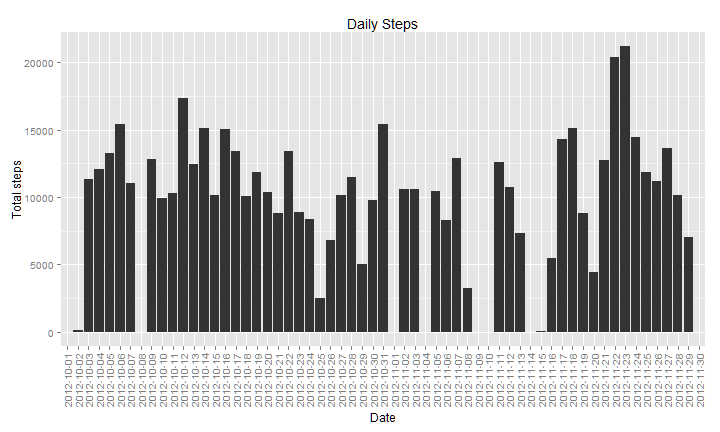
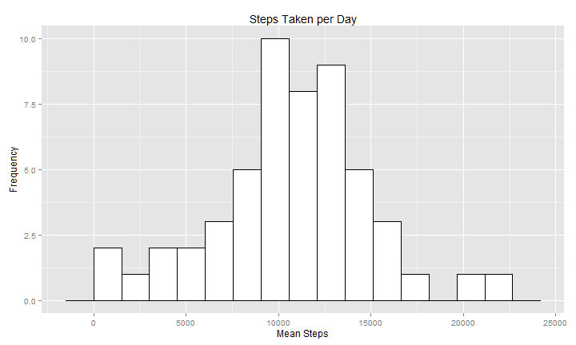
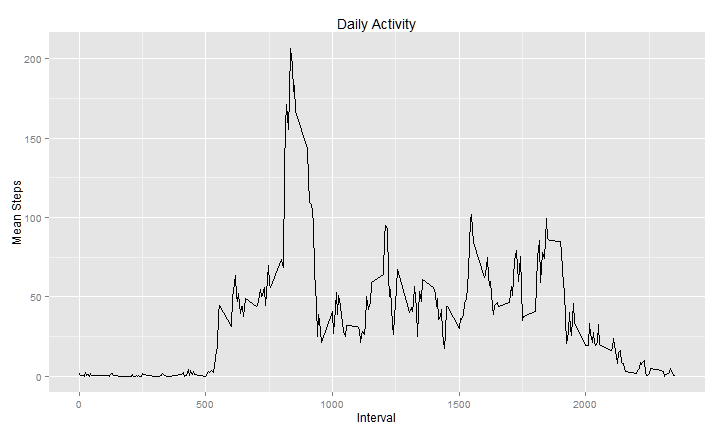
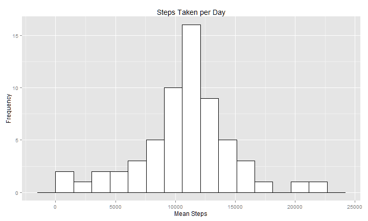
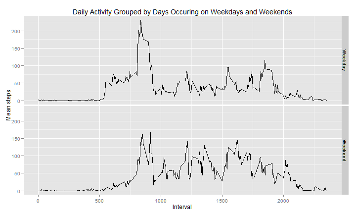

RepData_PeerAssessment1
========================================================

This assignment makes use of data from a personal activity monitoring device. This device collects data at 5 minute intervals through out the day. The data consists of two months of data from an anonymous individual collected during the months of October and November, 2012 and include the number of steps taken in 5 minute intervals each day.


**Loading and preprocessing the data**


```r
library(ggplot2)
library(scales)
library(sqldf)
```

```
## Loading required package: gsubfn
## Loading required package: proto
## Loading required package: RSQLite
## Loading required package: DBI
## Loading required package: RSQLite.extfuns
```

```r
library(plyr)

# Load the file if present,
# if not, load the file from the zip if present,
# if not, load the file from the online source.
if (file.exists("./raw-data/activity.csv")) {
  data <- read.csv("./raw-data/activity.csv")
  print("The data has been loaded from the local csv.")
} else if( !file.exists("./raw-data/repdata-data-activity.zip") ) {
    temp <- tempfile()
    download.file("https://d396qusza40orc.cloudfront.net/repdata%2Fdata%2Factivity.zip", temp)
    data <- read.csv(unz(temp, "activity.csv"))
    unlink(temp)
    print("The data has been loaded from the local zip file/")
} else {
    temp <- "./raw-data/repdata-data-activity.zip"
    data <- read.csv(unz(temp, "activity.csv"))
    unlink(temp)
    print("The data has been loaded from a remote source.")
}
```

```
## [1] "The data has been loaded from the local csv."
```

```r
dailySums <- aggregate( steps~date, data=data, FUN=sum, na.rm=TRUE)
dailyMeans <- aggregate( steps~interval, data=data, FUN=mean, na.rm=TRUE)
```

**Overview of daily data**


```r
ggplot(data, aes(x=factor(date), y=steps)) + stat_summary(fun.y="sum", geom="histogram", na.rm=TRUE) + theme(axis.text.x = element_text(angle = 90, vjust = .5, hjust = 1)) + xlab("Date") + ylab("Total steps") + ggtitle("Daily Steps")
```

 

**What is the mean total number of steps taken per day?**


```r
ggplot(data=dailySums, aes(x=steps)) + geom_histogram(binwidth = diff(range(dailySums$steps))/14, fill="#FFFFFF", colour="black") + xlab("Mean Steps") + ylab("Frequency") + ggtitle("Steps Taken per Day")
```

 

Calculate and report the mean and median total number of steps taken per day


```r
meanSteps <- round( mean( dailySums$steps, na.rm = TRUE ), 1 )
medianSteps <- round( median( dailySums$steps, na.rm = TRUE ), 1 )
```

*A: The mean daily steps is: 10766, and the median daily steps is: 10765*


**What is the average daily activity pattern?**


```r
ggplot(dailyMeans, aes(interval, steps)) + geom_line() + xlab("Interval") + ylab("Mean Steps") + ggtitle("Daily Activity")
```

 

Which 5-minute interval, on average across all the days in the dataset, contains the maximum number of steps?


```r
mostActiveInterval <- dailyMeans[which.max(dailyMeans$steps),]
```

*A: The most active daily mean interval is 835 with 206.1698 steps.*


**Imputing missing values**

Calculate and report the total number of missing values in the dataset.


```r
naCount <- length(which(is.na(data$steps)))
```

*A: The total number od NA values in the dataset is 2304.*

Devise a strategy for filling in all of the missing values in the dataset.

*A: The strategy was to calculate the aggregate steps after removing NA values.*

Create a new dataset that that replaces missing values with the 5 minute average across all days.


```r
#dataImmuted <- data[complete.cases(data),]

dataImmuted <- data
for (j in 1:nrow(dataImmuted)) {
  if (is.na(dataImmuted$steps[j])) { 
    dataImmuted$steps[j] <- dailyMeans$steps[dailyMeans$interval == dataImmuted$interval[j]]
  }
}
```

Make a histogram of the total number of steps taken each day and Calculate and report the mean and median total number of steps taken per day.


```r
dailySumsImmuted <- aggregate( steps~date, data=dataImmuted, FUN=sum, na.rm=FALSE)
dailyMeansImmuted <- aggregate( steps~interval, data=dataImmuted, FUN=mean, na.rm=FALSE)

meanStepsImmuted <- round( mean( dailySumsImmuted$steps, na.rm = FALSE ), 1 )
medianStepsImmuted <- round( median( dailySumsImmuted$steps, na.rm = FALSE ), 1 )
```


```r
ggplot(data=dailySumsImmuted, aes(x=steps)) + geom_histogram(binwidth = diff(range(dailySumsImmuted$steps))/14, fill="#FFFFFF", colour="black") + xlab("Mean Steps") + ylab("Frequency") + ggtitle("Steps Taken per Day")
```

 

*A: Mean daily steps: 1.0766 &times; 10<sup>4</sup>, Median daily steps: 1.0766 &times; 10<sup>4</sup>*

Do these values differ from the estimates from the first part of the assignment? 

*A: Yes, the immuted calculations vasy slightly.*

What is the impact of imputing missing data on the estimates of the total daily number of steps?

*A: Without immuting the data the median would reflect the missing values by being slightly lower. There is a chance that the averave would also be higher, although it is not the case in this data set.*


**Are there differences in activity patterns between weekdays and weekends?**

Create a new factor variable in the dataset with two levels, for weekday and weekend and bind it to the data.


```r
partOfWeek <- weekdays(as.Date(dataImmuted$date)) == "Sunday" | weekdays(as.Date(dataImmuted$date)) == "Saturday"
partOfWeek <- ifelse(partOfWeek==TRUE, "Weekend", "Weekday")
partOfWeek <- as.factor(partOfWeek)

dataImmuted <- cbind(dataImmuted, partOfWeek);

stepInterval <- sqldf("select interval, partOfWeek, sum(steps) as steps, count(steps) as count from dataImmuted group by interval, partOfWeek");
```

```
## Loading required package: tcltk
```

```r
average <- stepInterval$steps / stepInterval$count;
stepInterval <- cbind( stepInterval, average );
```

Make a panel plot containing a time series plot (i.e. type = "l") of the 5-minute interval (x-axis) and the average number of steps taken, averaged across all weekday days or weekend days (y-axis).


```r
ggplot(stepInterval, aes(interval, average)) + geom_line() + xlab("Interval") + ylab("Mean steps") + ggtitle("Daily Activity Grouped by Days Occuring on Weekdays and Weekends") + facet_grid(facets=partOfWeek ~ .)
```

 
